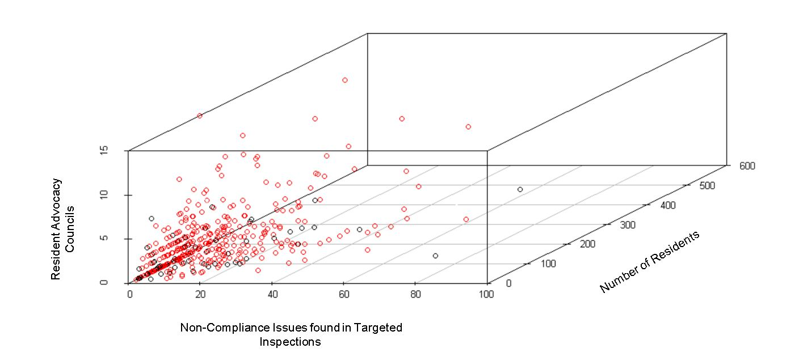
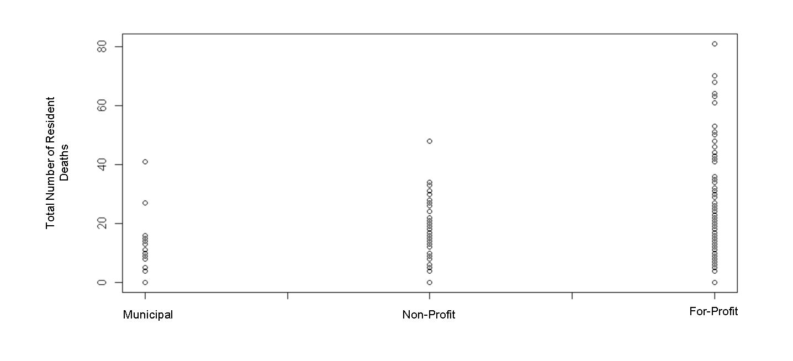
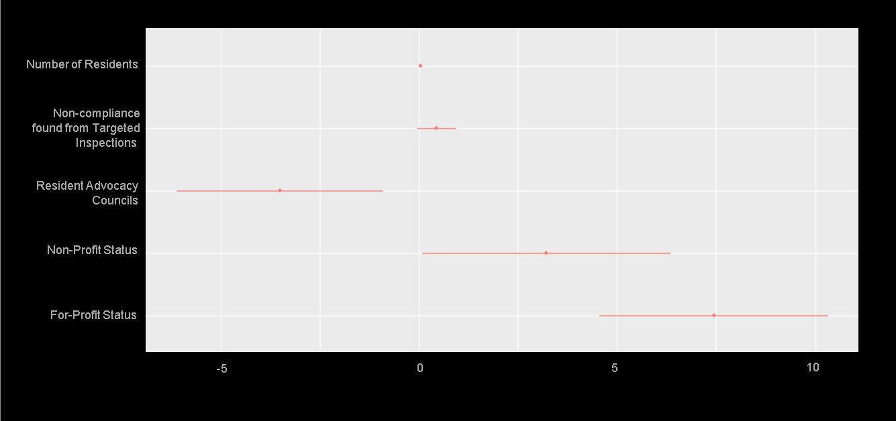

## Predicitive Factors for COVID19 Death in Long Term Care Facilities in Ontario

I chose to use Ontario's public data on COVID19 outbreaks in long term care facilities to see if facility factors predicted death outcome. My data is from various public ontario records that can be found [with the rest of my code](https://github.com/raywoo32/BioHacks2021). 

I used linear model and found 5 predictors of mortality through a step-wise regression model. My results were significant, with R-squared of 0.13 and a p-value < 0.005. While this may not seem like a lot of predictive power, I would argue that 13% is worth investigating given that the context is predicted mortality in a pandemic. My significant variables are: 

1. Number of Beds/Residents
2. Number of Non-compliance issues found in targeted inspections
3. Number of Councils for Resident Advocacy (resident and family councils) 
5. Non-Profit Status
6. For-Profit Status

### Results

Interestingly, one of the variables with the most explanatory power is the presence of Family councils and Resident councils which advocate for the residents of the long term care facilities. Advocacy groups had a negative coefficient meaning that more facilities with more advocacy groups tended to have less deaths. More non-compliance issues in a targeted investigation predicted more deaths as well. This is unsurprising but the interesting result is that non-compliance issues in annual inspections had no predicitive power. This implies targeted investigations are needed to ensure that facilities are safe. Unsurprisingly the number of residents was also a singificant facotr which makes sense for a highly contagious disease. 

The profit motive had signfiicant explanatory power, the least deaths occured in munipical publically funded facilities followed by non-profit facilities and for-profit facilities. While it would be impossible to say if this is causisitive it certaintly warrents further investigation. 

This plot shows the predicitive power of each of the significicant dependent variables. 

### Interpreting the results 

My results are very preliminary and require further inestigation and data collection. For example, one larging missing factor is the average age and sex for each LTC facility. However, I think that given further information this model could be valuable for actionable plans to improve the care in long-term facilities. 

### Methodology

My methods were mainly data cleaning and web-scraping to integrate different data sources. Please see my github for[ the rest of my code](https://github.com/raywoo32/BioHacks2021). I did the following

1. Webscrape government website to get data on complicance in inspections 
2. Webscrape government website to get data on profit status
3. Integrate and clean data (only 29 out of 514 long term care homes were excluded due to missing data) 
4. Create linear model 

